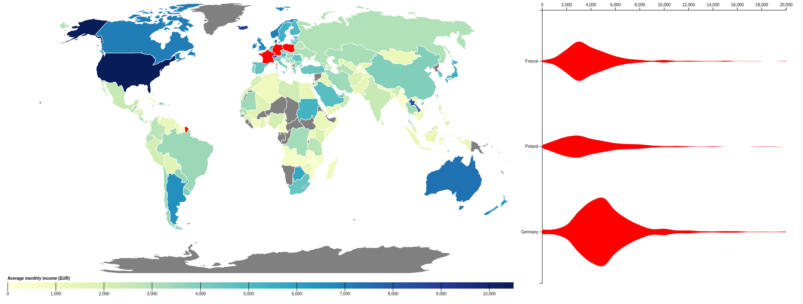

# IT Salaries Visualization

This is a simple visualization of IT salaries based on data collected in [Stack Overflow Survey 2018](https://www.kaggle.com/datasets/stackoverflow/stack-overflow-2018-developer-survey). The goal of the app is to provide insight into salaries around the globe with option to filter them by country, age and position.

The app is accessible on https://it-salaries-visualization.glitch.me/.

To deploy the app locally, run `npm start`.

